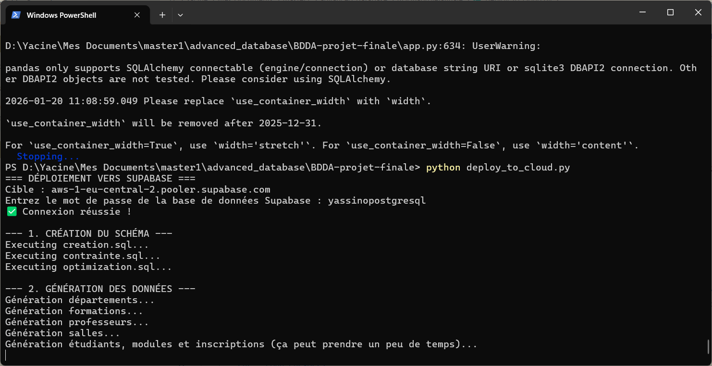
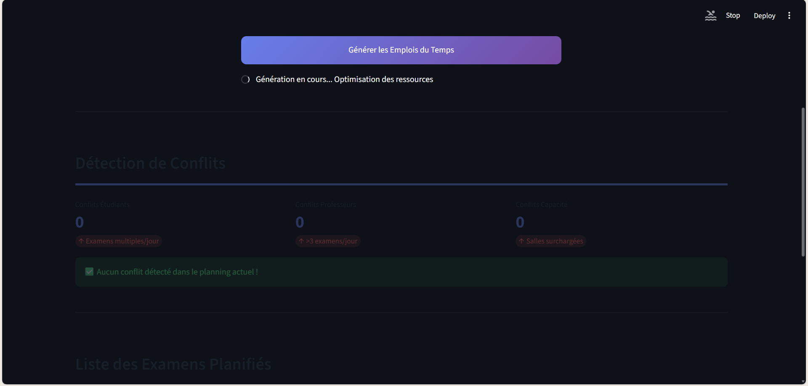
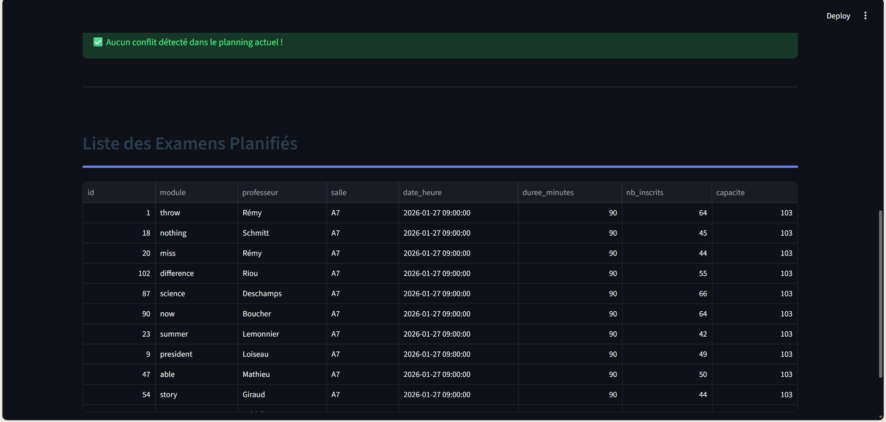
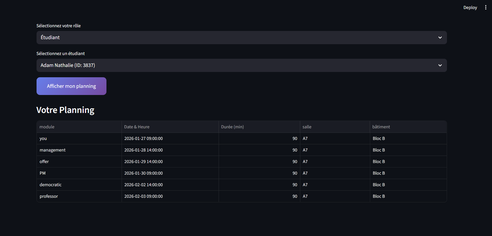
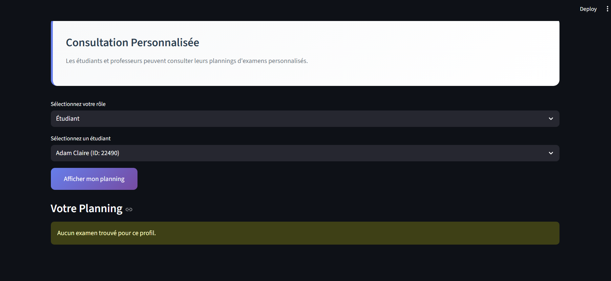

# Exam Scheduler

<<<<<<< HEAD
## Prerequisites
Ensure Python and PostgreSQL are installed.

## Installation & Setup
1. **Install Deps**: `pip install -r requirements.txt`
2. **Setup DB**: Create a database named `exam_scheduler`.
3. **Import Schema**: Run `psql -U postgres -d exam_scheduler -f creation.sql` then `contrainte.sql`.
4. **Optimize**: Run `psql -U postgres -d exam_scheduler -f optimization.sql` (Password: `yassinopostgresql`).
5. **Gen Data**: Run `python data.py` to populate the database with mock data.
6. **Run App**: Execute `streamlit run app.py` and open the URL shown.

## Usage
- **Usage**: Go to "Administration" > "Générer" to build the schedule.
- **View**: Go to "Consultation" to see individual timetables.

## Deployment (Cloud)
- **Deploy**:
    - Push to GitHub.
    - Connect to Streamlit Cloud.
    - Set Secrets in Streamlit Settings for your Cloud DB (Neon/Supabase).
    - To fill Cloud DB from local PC (optional helper):
      ```powershell
      python deploy_to_cloud.py
      ```

## Screenshots

### Data Generation


### Exam Generation Process


### Exam List


### Planning (After Generation)


### Student View (No Exams / No Planning)


=======
Prerequisites: Ensure Python and PostgreSQL are installed.
Install Deps: pip install -r requirements.txt
Setup DB: Create a database named exam_scheduler.
Import Schema: Run psql -U postgres -d exam_scheduler -f creation.sql then contrainte.sql.
Optimize: Run psql -U postgres -d exam_scheduler -f optimization.sql (Password: yassinopostgresql).
Gen Data: Run python data.py to populate the database with mock data.
Run App: Execute streamlit run app.py and open the URL shown.
Usage: Go to "Administration" > "Générer" to build the schedule.
View: Go to "Consultation" to see individual timetables.


>>>>>>> 19de5d26 (update pictures)
